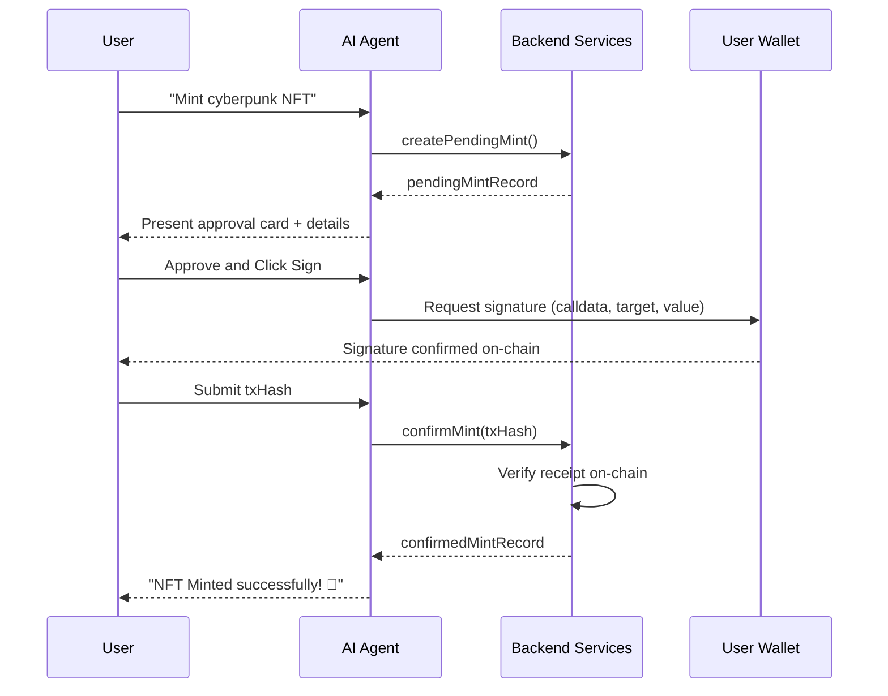

# WCOS AI Assistant & Orchestrator Manual

This document provides a comprehensive guide to the AI Agent and transaction orchestration system, including prompt engineering, tool registries, approval engines, and security boundaries.

---

## 1. System Architecture & Operation Modes

WCOS-Agent operates in two distinct modes:

### Assistant Mode:
- **Scope**: Chatting, navigation support, and read-only queries (e.g. "What is my wallet address?").
- **Auth**: Leverages standard user session authentication.
- **Approvals**: No transaction validation cards are required.

### Agent Mode:
- **Scope**: Multi-step action planning and transaction preparation (e.g. "Prepare swap for 0.1 ETH to WGT").
- **Auth**: Explicit wallet connectivity check required.
- **Approvals**: Generates time-limited, single-use `AgentApproval` cards that must be accepted by the user before transaction data is returned.

---

## 2. Wallet Signature Boundary & Security Policies

> [!IMPORTANT]
> The AI Orchestrator must NEVER:
> - Request, read, store, or transmit wallet private keys or seed phrases.
> - Bypassing wallet confirmation to submit transactions on behalf of the user.
> - Sign transactions or execute financial transfers autonomously.
>
> The AI orchestrator will ONLY:
> - Prepare unsigned transactions (returning target, data, and value).
> - Estimate gas fees.
> - Re-validate parameters and re-verify blockchain confirmation hashes on-chain.

---

## 3. Tool Calling Registry & Risk Classification

All tools are strictly categorized by risk level to enforce human-in-the-loop triggers:

| Tool Name | Risk Level | Requires Wallet | Requires Approval | Description |
| --------- | ---------- | --------------- | ----------------- | ----------- |
| `getProfile` | `READ_ONLY` | No | No | Retrieves user profile metadata |
| `getCreatorAnalytics` | `READ_ONLY` | Yes | No | Fetches actual DB creator metrics |
| `getSwapQuote` | `READ_ONLY` | Yes | No | Queries OpenOcean swap quote |
| `prepareNFTMint` | `HIGH` | Yes | Yes | Creates pending mint and selector data |
| `prepareSwapQuote` | `HIGH` | Yes | Yes | Prepares DEX swap transaction parameters |
| `prepareStaking` | `HIGH` | Yes | Yes | Prepares staking contract calls |
| `prepareVote` | `HIGH` | Yes | Yes | Prepares Governor castVote transaction |

---

## 4. Multi-Step Execution & Verification Workflow

