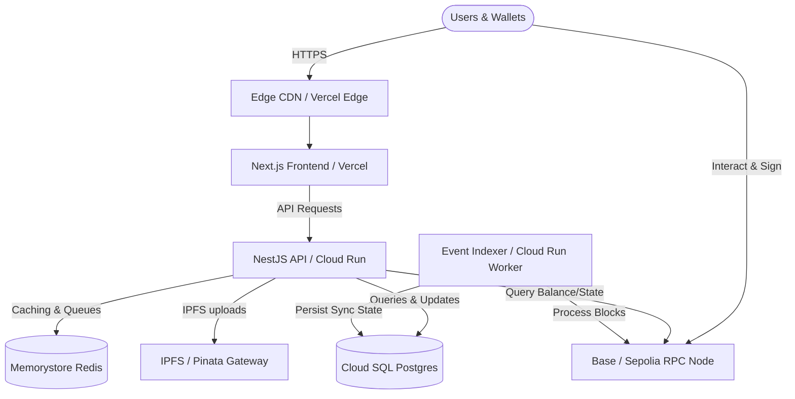

# Web3 Creator OS (WCOS) — Deployment Architecture

This document details the network, traffic flow, and connection endpoints between all core services.

## Architecture Diagram

## System Interfaces & Ports
* **Frontend Web Application**: Port 3000 (Local Dev) / Port 443 (Production HTTPS).
* **Backend API Gateway**: Port 3001 (Local Dev) / Port 4000 (Container) / Port 443 (GCP HTTPS).
* **PostgreSQL Database**: Port 5432.
* **Redis Cache**: Port 6379.
